# Welcome

Stairs is a simple tool which allows you to slice and dice and make sense of 
your data. 

You can build data pipelines and make parallel, async or distributed calculations 
for most of your data related tasks.

Stairs available for Python3, but you can write data processors in any language. 
You can also use any of streaming or queue services which you want. 

It's easy to start, test all your ideas or hypotheses in a quick way and it is 
ready for immediate use without any special magic. 

Get started with Installation and then get an overview with "Get started". 

# Installation


```python
# install redis https://redis.io/topics/quickstart
# sudo apt-get install redis
# brew install redis

pip install stairs-project
```


> It's recommended to use the latest python 3 version

Just make `pip install stairs-project` to install stairs along with all 
python dependencies.

Stairs requires redis for storing statistic and some meta-information, 
even if you use different streaming or queue service. 

<aside class="notice">
Stairs requires a running redis server to work
</aside>

# Mission

## Data Pipelines

<!-- > 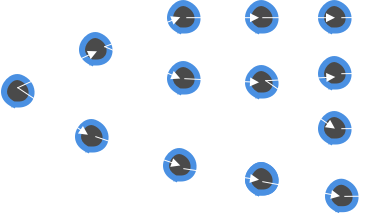 -->

The main Stairs focus is data pipelines. It's a framework which helps you to
build and manipulate data through the data flow graph. 

You can think of it as of an MVP framework (like Django) for data pipelines.
Different layers of abstractions and components allow you to build any kind of 
data flow graph and easily understand what's going on in your system. 


## Parallel/Async/Distributed

<!-- > 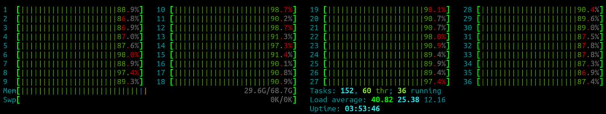 -->

Each component of data pipeline could be represented as a separate python process (worker). Each component comunicates
with each other using streaming/queues services and together could process your data in a parallel way.

Right now stairs using: <br>
- celery <br>
- self-implemented redis queue <br>
- kafka (under development) <br>

There is interesting wiki article about workers/jobs -> [Wiki](https://en.wikipedia.org/wiki/Job_(computing))

Stairs framework focusing on speed and light, and speed of your "workers" mostly limited by your streaming/queues service.


## For data-science and data-engineering with love

<!-- > 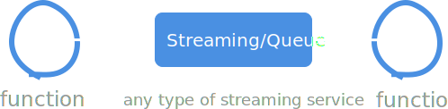 -->

Data-science and data-engineering growing fast, and it's hard to be expert on everything
at the same time. 

For example to train ML models, you should spend about 80% of the time to process data -- how fast 
you will be able to process your data and test all hypotheses, directly influence your final result.

Stairs allows data scientist to build "scalable" solutions without high-level data-engineering skills.

- Data-scientist could focus only on data processing
- Data-engineer could focus only on storing and moving data (between pipeline components)


#Get started


##Project

```shell
stairs-admin project:new name
```

> 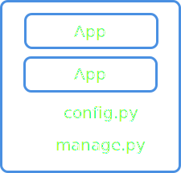


When you done with installation let's try to kick-start your first stairs project.

Stairs project kind similar to django approach (when you can create default project template). 
To have better overview of your components you can create similar project in stairs. It will contain apps with all basic layears inside. <bt>
But you completely free to use another structure which you want. Default project template is just a way to quikly kick start your idea. 


For creating default project template just use the following command:

`stairs-admin project:new name`


This command will generate a basic project structure with one app inside.<br>

The project has a config file and "manager.py".

"manager.py" - in Django manner allows you to read config, detect apps and execute shell commands.


<br><br><br><br><br><br>


##App

```shell
stairs-admin app:new name
```


> 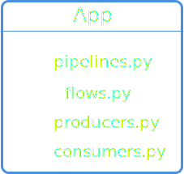


App - it's a way to generalize different approaches to one similar form - why? Because right now
data-science approaches too scattered and it's hard to understand what's going on when you have
a ton of maths and algorithms around. 


Each app has the following components:

- pipeline - represents a data flow graph and determines how the data will be processed. Each pipeline consists of multiple smaller components like "Flow" (Data flow).  

- producer - function which helps you to read the source (file, database ...) and then follow it to data pipeline.

- consumer - function which writes data to data store or change "global state".

- flow (Data Flow) - set of functions (called [steps](https://en.wikipedia.org/wiki/Job_(computing))) which could change/filter/populate your data.


To create new "default" app use following command:

`stairs-admin app:new name`


```python
from stairs import App

app = App(name="my_app")

```

To define your app you should initialize App object with name and config (More about app config in "App components" section).

If you want to add a new app to the project, populate `apps` variable in the config file or use `StairsProject.add_app(app)`

<br>

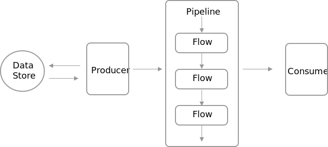

<br>

#App components


## Pipeline

```python

@app.pipeline()
def my_pipeline(pipeline, value):
    return value.subscribe_func(my_function_which_process_data, as_worker=True) \
                .subscribe_flow(MySecondFlow())\
                .subscribe_consumer(save_result)

```


Pipeline - it's a way to connect multiple objects (functions/classes/other pipelines) into one big graph. 

The way how it's works a bit tricky but quite simple to understand. Input of each pipeline could be any data you want, then
you can subscribe some objects to this data, and connect more and more objects to one big graph which super easy to understand
and manipulate.

Each pipeline component - could be a worker, which communicates with other components through streaming/queue service.

To run pipeline (and let data go through pipeline components) use: <br>
`python manager.py pipelines:run`

It will run all workers and start process your queue (using streaming/queue service).

If you want to run some particular pipeline use following command: <br>
`python manager.py pipelines:run app_name.pipeline_name` <br>

Let's dive a bit deeply to pipelines structure:


<br>

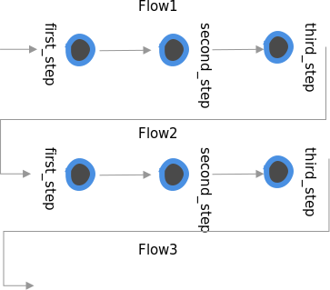

<br><br>

---

```python

@app.pipeline()
def full_pipeline(pipeline, value1, value2, value3):

    # DataFrame
    all_at_once = concatinate(data_point1=value1,
                              data_point2=value2,
                              data_point3=value3)

    # DataFrame
    my_flow_result = all_at_once.subscribe_func(my_function, as_worker=True)

    # DataPoint
    flow_data_point = my_flow_result.get("result_data_point")

    # DataFrame
    result = flow_data_point.subscribe_flow(MyFlow2())\
                            .make(result=flow2_result)

    return result

@app.pipeline
def short_pipeline(pipeline, value1, value2, value3):

    # DataFrame
    result = concatinate(data_point1=value1, 
                         data_point2=value2, 
                         data_point3=value3)\
             .subscribe_func(my_function, as_worker=True)\
             .get("result1")\
             .subscribe_flow(MyFlow2())\
             .make(result='result1')\

    return result

```

### Manipulating data inside pipeline

An input of stairs pipeline is a ["mock"](https://en.wikipedia.org/wiki/Mock_object) values called "DataPoint" - it's a representation of the ANY data which will be executed inside pipeline components. 

The mock data will be converted to "real" data as soon as you call pipeline: <br>

`short_pipeline(value1=1, value2=2, value3=3)` <br>

But this "real" data will be accesseble only inside functions and flows which you used in subscribe methods.
(you can't use "real" values directly inside pipeline function - this function it's just for building pipelines, not for data manipulation)

You can subscribe DataPoint by some function or Flow component and result of this subscription will be a new object called "DataFrame" 
(kind of dict object with key:DataPoint structure) - it represents a result of your flow.

You could subscribe both DataPoint or DataFrame. But if you want to extract some values from DataFrame (the result of your flow) you can use
`get('value')` method. The result of the "get" method will be DataPoint.

If you want to modify your DataFrame you can use `make(value=new_value)` method and result will be new DataFrame.

Now one of the most interesting part: If you want to combine multiple DataPoints and DataFrame into one DataFrame you can use 
`concatenate(value1=data_point, value2=data_point2)` function - which return DataFrame with defined arguments. 


Here an example of the pipeline -> 

As you can see It's quite simple to define such complex and hard architecture just with 6 lines of code.
And it's a bit similar to how we define Neural Networks using [Keras](https://keras.io/)

<br>

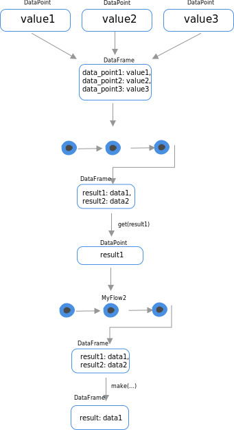
<br><br>

---

```python

@app.pipeline()
def my_pipeline(pipeline, value):
    return value.subscribe_flow(MyFlow(), as_worker=True) \
                .apply_flow(MySecondFlow())\
                .subscribe_consumer(save_result)

```

### How flow change data

Pipeline components could accumulate data or completely change/redefine it. 

For this stairs has two defenitions: <br>
- subscribe_smths <br>
- apply_smths <br>

subscribe - accomulate/update data <br>
apply - completely redefine data based on pipeline component result. 

<br><br>

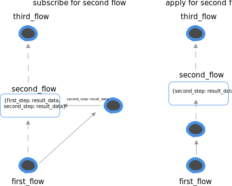

<br>


---

```python

@app.pipeline()
def base_pipeline(pipeline, value):
    return value.subscribe_flow(BaseFlow())

@app.pipeline()
def my_pipeline(pipeline, value):
    return value.subscribe_pipeline(base_pipeline)\
                .subscribe_consumer(save_result)

```

### Call another pipeline

Inside your pipeline, you can use any other pipelines. 

Note: that all pipelines - is a worker, and you can't set worker=False to a pipeline. 

The app and pipelines structure is quite scalable for configuration, you can set new config values when call new pipeline

`value.subscribe_pipeline(base_pipeline, config=dict(path='/home'))`

<br><br><br><br><br><br><br><br><br><br><br>


---

```python

def custom_function(new_value):
    return dict(new_value=new_value*2)


@app.pipeline()
def base_pipeline(pipeline, value):
    return value\
        .subscribe_func(lambda value: dict(new_value=value+1), name='plus_one')\
        .subscribe_func(custom_function, as_worker=True)

```

### Subscribe any function you want

It's possible to add any function you want inside your data pipeline. 

If you are using lambda function it's quite important to set name, because otherwise
if this function will be a worker it will be imposible to recognize it. 


<br><br><br><br><br><br><br><br><br><br><br>

---

```python

def custom_function(value):
    return dict(new_value=new_value*2)


@app.pipeline()
def base_pipeline(pipeline, value):
    return value\
        .subscribe_func(custom_function)\
        .add_value(file_path='/tmp/save_data.txt')\
        .subscribe_consumer(save_to_file, as_worker=True)

```

### Custom values

It's possible to add some additional values (with real data) into your pipeline. 

It useful when you want to configure something. 

<br><br><br><br><br><br><br><br><br><br><br>


## Flow


```python
class MyFlow(Flow)
    @step(None)
    def first_step(self, value):
        return dict(first_step_result=value)

    @step(first_step)
    def second_step(self, first_step_result):
        return dict(second_step_result=first_step_result)
```

Flow - It's a low-level component which actually defines data pipeline. 

The problem with data pipelines builders that's it's not quite easy to change/redefine something, also big amount of functions
makes pipelines like a hell of dependenses (luigi good example of it). <br>
For solving this problems we have FLOW component which can be used for: <br>

- Easy change/redefine/extend your pipeline. (Just use python inheretence)
- Easy to configure 
- Easy to understand what's going on
- Each Flow could be a worker - Flow have steps which should be run inside some worker

Flow represents data flow graph as a chain of functions called "steps". You can connect those steps simply define "next step" in decorator:

`@step(next_step, next_step ... )`

The last step in your graph should be defined with next step set to None.

`@step(None)`


All steps executed in one "worker" (process).

The structure of `Flow` class actually insperead by [stepist](https://github.com/electoronick1/stepist)

---

```python
class MyFlow(Flow)
    @step(None)
    def third_step(self, value, first_step_result, second_step_result):
        # which actually means value * 3
        return dict(flow_result=value+first_step_result+second_step_result)

    @step(third_step)
    def second_step(self, first_step_result):
        return dict(second_step_result=first_step_result)

    @step(second_step)
    def first_step(self, value):
        return dict(first_step_result=value)    
   
```

The input for the next step is output from the current. 

Result of each step is accumulating, this means that from any low-level steps you will be able to get values from high-level steps:

<br><br><br><br><br><br><br><br><br><br>

---

```python
class MyFlow(Flow)
    @step(None)
    def second_step_2(self):
        pass

    @step(None)
    def second_step_1(self):
        pass

    @step(second_step_1, second_step_2):
    def first_step(self):
        # this step will be executed right after
        # root1 and root2
        # data from root1 and root2 will be merge into current step
        pass
```

You can define multiple "next" steps and this will allow you to build complex branched out pipelines, like on example bellow ->

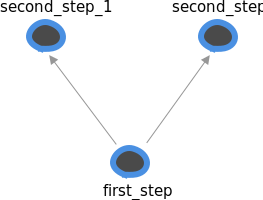
<br><br><br><br><br>

---

```python
from stairs import FLow, step

class MyFlow(Flow):
    def __call__(self):
        result_for_2 = self.calculate_stats(value=2)
        result_for_4 = self.start_from(self.calculate_stats, value=2)

        return result_for_2.validate_data.value + result_for_4.validate_data.value
    
    @step(None)
    def validate_data(self, value):
        value = max(value, 100)

        return dict(value=value)
    
    @step(validate_data)
    def calculate_stats(value):
        return value ** 2
            
```

Now, to execute your flow class you should have `__call__` methoud defenied. 

Inside `__call__` you can execute any step from your flow. Then whole chain (pipeline) of steps will be executed. 

`self.mystep(**kwargs_for_highest_step)`

or

`self.start_from(self.mystep, **kwargs_for_highest_step)`


As a result, you will get data from the last step in your pipeline (with the next_step set to None).


<br><br><br><br><br><br><br><br><br><br><br>

---

```python
from stairs import FLow, step

class MyFlow(Flow):
    def __call__(self, value):
        result = self.start_from(first_step, value=value)
        return {**result.first_step, **result.second_step}
    
    @step(None)
    def second_step(self, value):
        return dict(power3=value ** 3)
    
    @step(second_step, save_result=True)
    def first_step(self, value):
        return dict(power2=value ** 2)
```

It's also possible to customize steps which should return back result data. 
Just set `save_result` flag to True. 

<br><br><br>

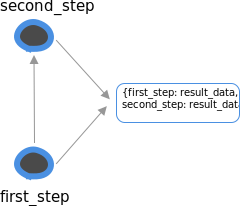

<br><br>

---

```python
from stairs import FLow, step

class MyFlow(Flow):
    def __call__(self, value):
        result = self.start_from(first_step, value=value)
        return {**result.first_step, **result.second_step}
    
    @step(None)
    def second_step(self, value):
        return dict(power3=value ** 3)
    
    @step(second_step, save_result=True)
    def first_step(self, value):
        return dict(power2=value ** 2)


class MyFlow2(MyFlow):

    @step(second_step, save_result=True)
    def first_step(self, value):
        return dict(power4=value ** 4)
```


Flow - it's a class, this means we could use inheritance to redefine some steps logic.

It's a very powerfull way to extend/change your data pipeline. 

<br><br>

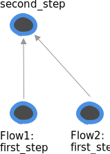

<br><br><br><br><br><br>

---

```python
from stairs import FLow, step

class MyFlow(Flow):
    def __call__(self, value):
        result = self.start_from(first_step, value=value)
        return {**result.first_step, **result.second_step}

    @step(None)
    def second_step(self, value):
        return dict(power3=value ** 3)
    
    @step(second_step, save_result=True)
    def first_step(self, value):
        return dict(power2=value ** 2)


class MyFlow2(MyFlow):

    def __reconect__(self):
        self.second_step.set_next(self.third_step)
        self.second_step.save_result = True

    @step(None)
    def third_step(self, value):
        return dict(power4=value ** 4)
```

Inheritance also allows you to reconnect some steps and change Flow structure.

It's possible to add a new step to the top, insert in the middle or add "save_result" flag.

<br><br>

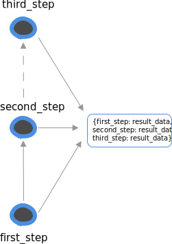

<br><br>


## Producer

Producer - it's a set of components for reading any types of data and then call pipeline to handle your data.

This component will populate your pipeline by "real" data which you can read from any source you want. 


So far, We have two types of producer components: <br>

- simple iterator <br>
- worker iterator - the way to safely read your data <br>


When you define producer you can call it from shell using manager.py:
` python manager.py producer:process `

<br><br>

---


```python

@app.producer(pipeline.my_pipeline)
def read_file():
    with open(FILE_PATH, "w") as f:
        for row in f:
            yield row

```

### Simple Producer

It's an iterator function which yields data to pipeline. You can run this "producer" from console:<br>
`python manager.py producer:process`

It's simply going by all items which producers yields and send them to streaming/queue service which then goes to pipeline. 

To prevent overfitting of your streaming service you can set "limit" and at the moment when producer reaches this limit it will sleep for a while. 

<br><br><br>

---


```python

@app.worker_producer(pipeline.my_pipeline)
def read_database():
    for i in range(AMOUNT_OF_ROWS / BATCH_SIZE):
        yield read_batch(i)

def read_batch(batch_id):
    interval = (batch_id*BATCH_SIZE, (batch_id+1)*BATCH_SIZE)
    cursor.execute("SELECT * FROM table where id>%s and id<%s" % interval)
    for row in cursor:
        yield row

```

### Worker Producer

It's a parallel/distributed way to populate your pipeline with data. It's almost 99% safe - it has smart features to prevent data loss or duplication.

The way how it works a bit complex then simple producer, but if you know something about "batch" processing - everything will be simple for you.

The idea to split your data by batches and read each batch independently. If the whole batch was read successfully it goes to pipeline. Internally Worker producer
using bitmaps to track all your batches status, and the only way when you can lose your data is a fail with redis.

Worker producer has two states: first initializing - it's just checking the number of batches and creates all needed meta information. 
To initilaze worker_producer run: <br>
`python manager.py producer:init`

It should be executed only once.

<br>

Then to start reading process you can run: <br>
`python manager.py producer:process`

As it was mentioned before worker_producer - it's a parallel way to read your data. So if you want more processes just run the command above multiple times. 
It will read batches from `producer:init` command.

In the same way like simple_producer it will prevent the queue from overfitting. 

<br><br><br>

## Consumer

```python
@app.consumer()
def save_to_redis(**data):
    redis.set(json.dumps(data))
```

Consumer - it's a set of components for writing/saving your data to any type of store or change the global state of your system.

You are free to write/save your data inside Flow component, but consumer it's not only about saving - it's a way to accumulate all
data to one place, and stairs has 3 types of consumers:

- "simple consumer" - just a simple function which should not return any data. Useful for saving data to data store.
- "standalone_consumer" - function which could be called as a separate process. Useful for writing data to a file or accumulating it inside one process for something. 
- "consumer_iter" - function which yields data from the pipeline. Useful when you want to train the neural network and needs data generator. 


Here on the right example of "simple consumer" -> 
<br><br>


--- 

```python
import json

f = open("file.txt", "w")

@app.standalone_consumer()
def write_to_file(**data):
    f.write(json.dumps(data))
    f.write("\n")

```


Standalone consumer it's a type of consumer which will NOT execute automatically.

To execute it and process data inside, you need to run a special command:

`python manager.py consumer:standalone app.write_to_file`


It useful when you need to write data using one process only (for example in case of file writing).
 

--- 


```python

@app.consumer_iter()
def x_data_for_nn(**data):
    return data

@app.consumer_iter()
def y_data_for_nn(**data):
    return data


# Example of pipeline
@app.pipeline()
def prepare_data_for_nn(pipeline, data)
    result_data = data.subscribe_flow(Flow())

    x_consumer = result_data.get('x')\
                            .subscribe_consumer(x_data_for_nn)
    y_consumer = result_data.get('y')\
                            .subscribe_consumer(y_data_for_nn)

    return concatinate(x=x_consumer, y=y_consumer)


if __name__ == "__main__"

keras.Model().fit(x=x_data_for_nn(),
                  y=y_data_for_nn())


```


Consumer as a separe process.

If you want to train a neural network, and use an output of your pipeline as a train set, you can use:<br>
`@consumer_iter()` component which allows you to read data from streaming/queue service directly to your function.


## APP Config

```python

# app_config.py

from stairs import App

app = App(name="myapp")

app.config = {"use_validation": False}

my_pipeline_config = {"validation_flow": ValidationFLow()}

# pipelines.py

@app.pipeline(config=my_pipeline_config)
def my_pipeline(pipeline, value):
    result = value.subscribe_flow(pipeline.config.validation_flow)

    if app.config.use_validation:
        result.subscribe_flow(ValidationFLow())

    return result


# another project

app.config.use_validation = True

```

It's a place when you can set up your app. 

App config allows defining app settings which useful when you want to share your app with the world.

Here it's also possible to define pipeline config like on example -> 

<br>


#Examples

##ETL example: hacker news

[github hacker_news](https://github.com/electronick1/stairs_examples/tree/master/hacker_news)<br>

The idea here is to extract data from some source (in that case google cloud), change it somehow and save in a elegant format 
(for example for creating charts then, or building neural networks).

You can start exploring this project from `producers.py` inside hacker_new app. 
In this module it's quite trivial where we are reading data, and what format we are using as a result

Then `pipelines.py` each producer will send data to pipelines, in our case we have two of them:<br>
- `cleanup_and_save_localy` - which makes basic text cleanup and filtering
- `calculate_stats` - which based on "clean" data calculates some stats which we need

Next (and last) `consumers.py` - the place where all data comes in the end of pipeline.

<br>

##ML example: bag of words

[github bag of words](https://github.com/electronick1/stairs_examples/tree/master/bag_of_words)<br>

He we trying to teach some neural network to solve [kaggle task "Bag of Words Meets Bags of Popcorn"](https://www.kaggle.com/c/word2vec-nlp-tutorial)

This example based on [this repo](https://github.com/wendykan/DeepLearningMovies/) And it's kind of copy-paste solution but to the much more better representation.

What does it means "better representation"? 

If you look inside this repo, it's just a plain code, 
when you want to make calculations in parrallel way it's not very trivial todo, 
also if you wnt to change something it's not easy to undestand whole data flow chages.

Stairs solving all of this problems:

- It make calculations in parallel by default
- You can easelly understand what's going on inside `pipelines.py`
- It super easy to change something (just redefine some methods in FLow clases)


#Features 

## Inspect status of your queues

```bash
python manager.py inspect:status app_name

# Queue: cleanup_and_save_localy
# Amount of jobs: 10000
# Queue decreasing by 101.0 tasks per/sec


python manager.py inspect:monitor app_name

# Queue: cleanup_and_save_localy
# Amount of jobs: 3812
# New jobs per/sec: 380.4
# Jobs processed per/sec: 10.0


```

There is two types of inspections:

- inspect:status - return current amount of jobs/tasks in your queue, and basic information about speed (not very accurate)
- inspect:monitor - return amount jobs added and processed per sec. Accurate, but working only for redis (so far)


## Shell


```bash
python manager.py shell
```

```python

In [1]: from stairs import get_project

In [2]: get_project().get_app("hacker_news")
Out[2]: <stairs.core.app.App at 0x105fa7d30>

In [3]: get_project().get_app("hacker_news").components.producers
Out[3]:
{'read_google_big_table': <stairs.core.producer.Producer at 0x1257c4828>}

In [4]: producer = get_project().get_app("hacker_news").components.producers.get("read_google_big_table")

In [5]: producer.process()

```

It's possible to run all producers, pipelines, consumers using ipython.


## Change queue/streaming server

```python
# in manager.py 

from stepist import App
from stairs.services.management import init_cli
from stairs.core.project import StairsProject

if __name__ == "__main__":
    stepist_app = App()
    celery = Celery(broker="redis://localhost:6379/0")
    app.worker_engine = CeleryAdapter(app, celery)

    stairs_project = StairsProject(stepist_app=stepist_app)
    stairs_project.load_config_from_file("config.py")
    init_cli()
```


Stairs is complitely based on stepist. You can just define new stepist app with new "broken" engine, 
and your stairs project is ready to go 

[Stepist](https://github.com/electronick1/stepist)


## Admin panel

```bash
python manager.py admin
```

It's a way to visualize all your pipelines, see status of queues and all information about each pipeline component


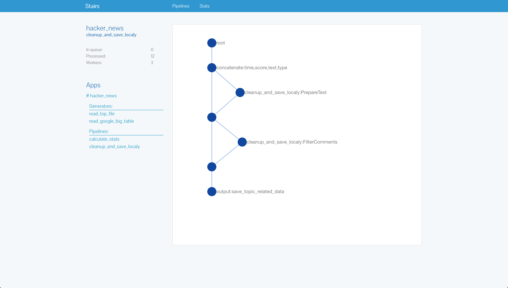

<aside class="notice">
Under development
</aside>

#FAQ


## What the reason behind apps?

```python

# example of app config

app = App("myapp")
app.config.update(
    train_data_path='/home/train.data'
)


# example of pipeline config

pipeline_config = dict(cleanup_flow=CleanUpText())

@app.pieline(config)
def external_pipeline(pipeline, value):
    return value.subscribe_flow(pipeline.config.cleanup_flow)

# in some other app, you can now make like this:
def my_pipeline(pipeline, value):
    config = dict(cleanup_flow=MYCleanup())
    return value.subscribe_pipeline(external_pipeline, config=config)

# And it ^ will be executed with your "clean up" flow 

```

The main idea is to simplify reusing externall solutions.

Data-Science world right now is very none standardized and stairs trying to create enviroment
where reusing someone approache will be easy and scalable for you. 

For example each app has a config, It's allow you to set different config variables to external apps (inside your app/project).

Each pipeline has a config. It's allow you to redefine some pipeline components or change any logic you want. 

One of the good example of configs it's [here](https://github.com/electronick1/stairs_examples/blob/master/bag_of_words/word2vec/app_config.py) 
or [here](https://github.com/electronick1/stairs_examples/blob/master/bag_of_words/word2vec/pipelines.py#L13)


## Why pipeline builder using "mocked" data ?

Pipeline builder `app.pipeline()` exists only for creating pipeline, configure it, 
and return "Worker" object which then will be executed using streaming/queue service. 

At the moment when we are building pipeline, we don't know nothing about real data which comes to it latter, 
so thats why we aggeread on some mock values and then populate this "mock" values from producer (or other pipeline).


## What data should return each pipeline component ?

Except "flow_generator" all components should return `dict` like format. Where we have key:value defined.

It's used for combaning "real" data with "mock" values. 


